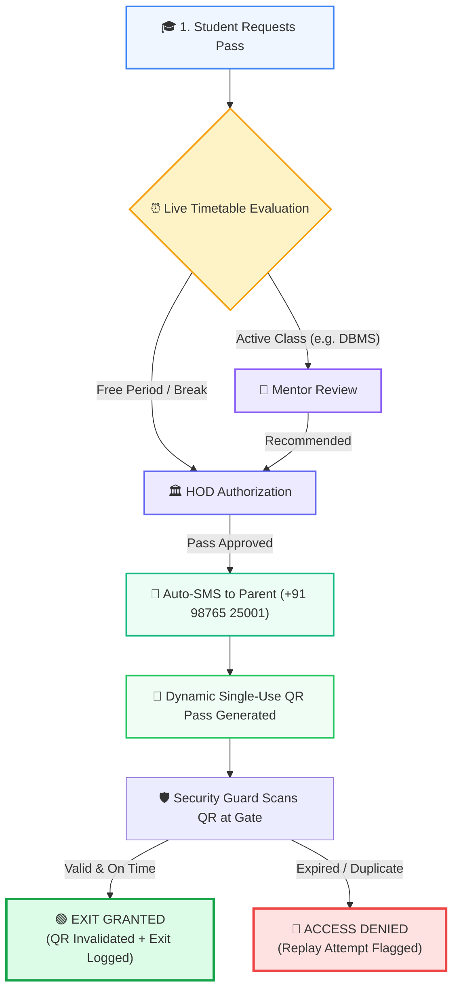

<div align="center">

# 🏛️ GATEGUARD · Campus Gate Pass Engine
### *Next-Generation, Timetable-Aware Campus Access Automation System*

Built for **S. B. Jain Institute of Technology, Management & Research (SBJITMR), Nagpur**

[](https://opensource.org/licenses/MIT)
[](https://nodejs.org)
[](https://www.typescriptlang.org/)
[](https://nextjs.org/)
[](https://expressjs.com/)
[](https://tailwindcss.com/)
[](https://www.mongodb.com/)
[]()

<br />

<p align="center">
  <a href="#-what-is-gateguard"><b>🌟 What is It?</b></a> •
  <a href="#-how-it-works-in-4-steps"><b>🔄 How It Works</b></a> •
  <a href="#-30-second-quick-start"><b>⚡ Quick Start</b></a> •
  <a href="#-role-based-portals"><b>👥 Role Portals</b></a> •
  <a href="#-demo-login-accounts"><b>🔑 Demo Logins</b></a> •
  <a href="#-system-architecture"><b>🏛️ Architecture</b></a> •
  <a href="#-project-structure"><b>📁 File Tree</b></a>
</p>

---

</div>

## 🌟 What is GATEGUARD?

Traditional college gate passes rely on manual paper slips, physical signatures, and manual logbooks. This leads to long queues, forgeable slips, and lack of parent awareness.

**GATEGUARD** replaces this entire manual process with an **intelligent, timetable-aware digital gate pass engine**:

- ⏰ **Timetable-Aware Decision Engine**: Automatically checks the student's live classroom schedule to decide who must approve the pass (*Lecture hour = Mentor → HOD approval; Free period / Break = Direct HOD authorization*).
- 📍 **GPS Campus Geofencing**: Confirms that the student is physically present inside the college perimeter before allowing pass creation.
- 📱 **Anti-Replay Dynamic QR Tickets**: Generates cryptographic QR codes with strict countdown timers that instantly lock and become invalid once scanned at the gate.
- 📩 **Instant Automated Parent SMS**: Immediately dispatches an SMS alert to the parent's registered mobile number upon faculty approval.
- 🛡️ **Instant Security Guard Verification**: High-contrast **Green (Valid)** or **Red (Denied)** visual feedback for gate security officers.

---

## 🔄 How It Works (In 4 Simple Steps)



---

## ⚡ 30-Second Quick Start

Get the entire frontend and backend up and running locally in 3 commands:

```bash
# 1. Clone the repository
git clone https://github.com/your-username/gateguard.git
cd gateguard

# 2. Install all dependencies (Frontend & Backend)
npm install
npm --prefix backend install

# 3. Start both dev servers concurrently
npm run dev           # Frontend on http://localhost:3001
npm run dev:backend   # Backend on http://localhost:5000
```

> [!TIP]
> **Zero-Config Database**: If you don't have MongoDB installed locally, GATEGUARD automatically spins up a built-in **In-Memory Mongo Database** and self-seeds **68 real students**, **40 timetable slots**, and demo staff accounts!

### 🌐 Active Local URLs

| Application Layer | URL | Purpose |
| :--- | :--- | :--- |
| **Clean Standalone UI** | [http://localhost:3001/index.html](http://localhost:3001/index.html) | Direct Light Theme Single-Page App |
| **Next.js Portal** | [http://localhost:3001](http://localhost:3001) | Fullstack Next.js Application |
| **Backend REST API** | [http://localhost:5000/health](http://localhost:5000/health) | Live Express Health Endpoint |

---

## 🔑 Demo Login Accounts

Pre-seeded with authoritative student & staff profiles for **S. B. Jain Institute (CSE AI&ML 3rd Sem)**:

| Role | Portal URL | Login ID / Email | Password | Access Level |
| :--- | :--- | :--- | :--- | :--- |
| **🎓 Student** | `/login` | `CM25001` *(or any up to `CM25068`)* | `student123` | Request passes, view live timetable & active QR ticket |
| **👔 Mentor / HOD** | `/login` | `warden@gateguard.demo` | `warden123` | Real-time queue review, 1-click approvals & SMS trigger |
| **🛡️ Security Guard** | `/login` | `guard@gateguard.demo` | `guard123` | Live camera QR scanner & gate exit audit logging |
| **⚡ Administrator** | `/login` | `admin@gateguard.demo` | `admin123` | System oversight, master timetable editor & audit logs |

---

## 👥 Role-Based Portals

<details open>
<summary><b>🎓 1. Student Dashboard & Pass Request</b></summary>
<br/>

- **Live Timetable Context**: Displays the active subject (*e.g., Database Management Systems · Dr. M. Khan*), slot timing, and remaining class duration.
- **Pass Request Form**:
  - Reason selector (*Medical, Academic Emergency, Family Matter, Free Hour*).
  - Out-time and expected return-time validation.
  - GPS campus location validation check (`21.2227° N, 79.0494° E`).
- **Dynamic QR Code Screen**:
  - High-contrast cryptographic QR ticket.
  - 30-minute validity countdown timer.
  - Student photo/badge, USN, reason, and approval timestamp.

</details>

<details>
<summary><b>👔 2. Mentor & HOD Faculty Approval Desk</b></summary>
<br/>

- **Real-Time Incoming Queue**: Displays pending student requests with highlighted timetable slot conflicts and parent contact numbers.
- **1-Click Fast Actions**:
  - `✓ Approve`: Generates the signed digital pass and immediately triggers automated Parent SMS dispatch.
  - `✕ Reject`: Rejects the pass and attaches faculty feedback remarks.
- **Daily Approval Counter**: Live stats on total pending reviews, approvals granted, and SMS dispatches.

</details>

<details>
<summary><b>🛡️ 3. Security Guard QR Scanner Terminal</b></summary>
<br/>

- **Camera Viewfinder**: Real-time camera scanner (`html5-qrcode`) + manual Pass ID lookup fallback.
- **Instantaneous Visual Feedback**:
  - 🟢 **GREEN (VALID PASS - EXIT GRANTED)**: Confirms student identity, marks pass `USED`, and records physical departure.
  - 🔴 **RED (ACCESS DENIED)**: Flags unapproved passes, expired tokens, or duplicate screenshot replay attempts.
- **Live Gate Exit Ledger**: Real-time table logging recent departures with timestamps and gate location.

</details>

---

## 🏛️ System Architecture

```text
┌────────────────────────────────────────────────────────────────────────┐
│                        CLIENT / FRONTEND LAYER                         │
│  • Next.js 16 (Turbopack) & Vanilla JS + Tailwind CSS (Light Theme)    │
│  • Single-Use QR Generation (qrcode.js) & Camera Scanner (html5-qrcode)│
│  • Smooth Rotating Watermark Background & Intro Splash Screen          │
└──────────────────────────────────┬─────────────────────────────────────┘
                                   │ HTTPS / JSON REST APIs
┌──────────────────────────────────▼─────────────────────────────────────┐
│                        GATEGUARD ENGINE (Node.js)                      │
│  • Express.js Server with TypeScript                                   │
│  • Timetable Engine (Conflict Detection & Dual-Track Routing)          │
│  • Geofence Service (Haversine Geodesic Radius Calculation)            │
│  • Cryptographic QR Signer (JWT Tokens with Expiry)                    │
│  • Simulated Parent SMS Dispatcher                                     │
└──────────────────────────────────┬─────────────────────────────────────┘
                                   │ Mongoose ODM / Drizzle ORM
┌──────────────────────────────────▼─────────────────────────────────────┐
│                            DATABASE LAYER                              │
│  • MongoDB / Mongo-Memory-Server (Auto-Seeded 68 Students & Timetables)│
│  • PostgreSQL Support via Drizzle ORM                                  │
└────────────────────────────────────────────────────────────────────────┘
```

---

## 📁 Project Structure

```text
GATEPASS3.0/
├── client/                     # Standalone Light Theme Web App
│   ├── index.html              # Main single-page application with intro & portals
│   └── assets/                 # Video intro (gatepass2.0.mp4) & logo (logo.png)
│
├── public/                     # Static Web Assets (Next.js & HTML)
│   ├── index.html              # Production single-page frontend
│   └── assets/                 # Institutional branding and video files
│
├── src/                        # Next.js Fullstack Application
│   ├── app/                    # App Router pages (/login, /student, /mentor, /guard)
│   ├── components/             # Reusable UI widgets & IntroSplashScreen.tsx
│   ├── db/                     # Drizzle ORM schema & Postgres connector
│   └── lib/                    # Authentication (JWT/Bcrypt) & seed logic
│
├── backend/                    # GATEGUARD REST API Engine
│   ├── src/
│   │   ├── config/             # DB connection & environment schema
│   │   ├── controllers/        # Auth, Pass, Gate, Student, Timetable controllers
│   │   ├── models/             # User, GatePass, Timetable, GateLog schemas
│   │   ├── services/           # Timetable evaluation, QR signer, Geofence
│   │   ├── seed/               # Authoritative SBJITMR student roster & timetable
│   │   └── server.ts           # Express startup & graceful shutdown
│   └── package.json            # Backend scripts & dependencies
│
├── package.json                # Root helper scripts (dev, dev:backend, test:backend)
└── README.md                   # Project documentation
```

---

## ⚙️ Environment Variables

Create `.env` inside `backend/` *(optional for local development since in-memory database auto-activates)*:

```env
PORT=5000
MONGODB_URI=mongodb://localhost:27017/gateguard
JWT_SECRET=gateguard_super_secret_jwt_key_2026_change_in_production
QR_SECRET=gateguard_dedicated_qr_signing_secret_key_2026
CAMPUS_LATITUDE=21.2227
CAMPUS_LONGITUDE=79.0494
CAMPUS_RADIUS_METERS=200
QR_EXPIRY_MINUTES=30
NODE_ENV=development
```

---

## 🧪 Available NPM Scripts

Run these from the project root directory:

| Command | Description |
| :--- | :--- |
| `npm run dev` | Starts the Next.js development server on port `3001` |
| `npm run dev:backend` | Starts the Express API server on port `5000` with hot-reloading |
| `npm run build:backend` | Compiles the backend TypeScript codebase with `tsc` |
| `npm run seed:backend` | Re-seeds the database with fresh student & timetable records |
| `npm run test:backend` | Runs the automated test suite using `vitest` |
| `npm run typecheck` | Validates TypeScript types across the entire project |

---

## 🗺️ Roadmap & Future Enhancements

- [x] **Live Timetable Awareness Engine** (Real-time conflict detection)
- [x] **Dual-Tier Approval Matrix** (Mentor → HOD & Direct HOD flows)
- [x] **Single-Use Dynamic QR Pass System** (Atomic status locking at gates)
- [x] **Simulated Parent SMS Notifications** (Instant parent alert on approval)
- [x] **Integrated Security Guard Camera Scanner** (Instant visual green/red feedback)
- [x] **Light-Theme UI with Rotating Watermark & Video Intro**
- [x] **Zero-Config In-Memory MongoDB Auto-Seeding**
- [ ] **WhatsApp Business API Gateway Integration** for parent alerts
- [ ] **Biometric Turnstile Hardware Sync** for automated gate barrier release
- [ ] **Progressive Web App (PWA)** offline support for security officers

---

## 📄 License & Credits

Distributed under the **MIT License**. See `LICENSE` for more information.

<div align="center">
  <sub>Built with ❤️ for <b>S. B. Jain Institute of Technology, Management & Research, Nagpur</b></sub>
</div>
